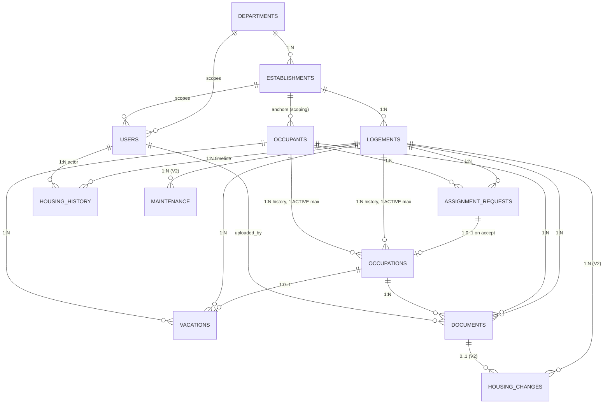

# GLO — Gestion des Logements de l'Oriental
## Phase 1 — Architecture & Database Design

**Status:** design proposal, awaiting validation before Phase 2 (code).
**Date:** 2 September 2026
**Stack:** Laravel 13 (API-only) · MySQL 8 · React 19 + Vite + Tailwind · Sanctum · Spatie laravel-permission

---

## 0. What already exists (audit of `C:\Users\pc\PhpstormProjects\GLO`)

Before proposing anything, here is the actual state of the repository today:

| Path | What it is | Verdict |
|---|---|---|
| `GLO/composer/` | A **pristine, untouched Laravel 13 skeleton** (`laravel/laravel`, PHP `^8.3`, `laravel/tinker ^3.0`) | Keep — but rename the folder |
| `GLO/composer/app/` | Only `Models/User.php`, `Providers/AppServiceProvider.php`, `Http/Controllers/Controller.php` — all stock | Nothing custom written yet |
| `GLO/composer/database/migrations/` | Only the 3 stock migrations (users, cache, jobs) | Clean slate |
| `GLO/composer/routes/` | `web.php`, `console.php` only — **no `api.php`** | Sanctum/API not installed yet |
| `GLO/composer/config/` | 10 stock files — **no `cors.php`, no `sanctum.php`, no `permission.php`** | Confirms neither package is installed |
| `GLO/composer/.env` | `DB_CONNECTION=sqlite`, `APP_KEY=` empty, `APP_NAME=Laravel` | Needs MySQL + key |
| `GLO/composer/CLAUDE.md` | Generic Laravel Boost bootstrap text, not project guidance | Replace with real project rules |
| `GLO/composer/package.json` | Tailwind 4 + Vite 8 + `laravel-vite-plugin` (Blade-oriented) | Leave for now; React lives elsewhere |
| `GLO/composer.json` (root) | `{"require": {"spatie/laravel-permission": "^6.25"}}` — 72 bytes | **Accident — delete** |
| `GLO/vendor/`, `GLO/composer.lock` (root) | ~180 KB lock + vendor tree from that accidental install | **Accident — delete** |

**Two problems to fix before writing any feature code:**

1. **The Laravel app lives in a folder literally named `composer`.** This looks like `composer create-project laravel/laravel composer` run with the wrong argument. It will bite you constantly: `cd composer && composer install` reads badly, IDE search paths get confusing, and any script or CI step that references "composer" becomes ambiguous. **Rename it to `backend/`.**
2. **Someone ran `composer require spatie/laravel-permission` from `GLO/` instead of from inside the app.** That created a stray root `composer.json` / `composer.lock` / `vendor/`. Spatie is *not* installed in the Laravel app. Delete the three root artefacts and re-run the require from inside the app.

### Target repository layout

```
GLO/
├── backend/              ← renamed from composer/   Laravel 13, API only
│   ├── app/
│   │   ├── Enums/
│   │   ├── Http/{Controllers/Api/V1, Requests, Resources, Middleware}
│   │   ├── Models/
│   │   ├── Policies/
│   │   ├── Services/
│   │   ├── Support/Scoping/
│   │   └── Observers/
│   ├── database/{migrations,factories,seeders}
│   ├── routes/api.php
│   └── storage/app/private/documents/    ← never web-accessible
├── frontend/             ← new   React 19 + Vite 7 + Tailwind + React Router
│   └── src/{api,auth,i18n,components,layouts,pages,hooks,lib}
├── docs/
│   └── ARCHITECTURE.md   ← this file
├── .gitignore
└── README.md
```

Two `.gitignore`-d `vendor/` and `node_modules/` trees, one Git repository at `GLO/`. Backend and frontend are deployed separately in production (Apache/Nginx serving `backend/public`, a static build of `frontend/dist` served from anywhere).

---

## 1. System architecture

```
┌──────────────────────────────┐         ┌──────────────────────────────────┐
│  React SPA  (Vite :5173)     │         │  Laravel 13 API  (:8000)         │
│                              │         │                                  │
│  React Router  ──┐           │         │  routes/api.php  /api/v1/*       │
│  TanStack Query  ├─ axios ───┼────────▶│      │                           │
│  Tailwind (RTL)  │  cookies  │  CORS   │      ▼                           │
│  i18n fr / ar  ──┘           │◀────────┤  Sanctum (stateful SPA session)  │
│                              │         │      ▼                           │
│  Auth ctx · Can<> guard      │         │  FormRequest  → validation       │
│  (UI hiding only — never     │         │      ▼                           │
│   the security boundary)     │         │  Policy       → authorization    │
└──────────────────────────────┘         │      ▼                           │
                                         │  Scope        → row visibility   │
                                         │      ▼                           │
                                         │  Service      → business rules   │
                                         │      ▼        (DB transactions)  │
                                         │  Eloquent → MySQL 8              │
                                         │      │                           │
                                         │      └─▶ AuditLogger → history   │
                                         └──────────────────────────────────┘
```

### The three-layer authorization model

This is the single most important architectural idea in GLO, and the spec already hints at it correctly. Keep the three concerns strictly separate:

| Layer | Question it answers | Implemented by |
|---|---|---|
| **Permission** | *Can this role do this kind of thing at all?* | Spatie `laravel-permission` — `logements.create` |
| **Scope** | *Which rows may this user see or touch?* | Query scopes: `Logement::visibleTo($user)` |
| **Policy** | *May this user do this to **this** record?* | Laravel Policies — combine permission + scope |

A `DEPARTMENT_ADMIN` from Nador has the `logements.update` permission (layer 1) but must be rejected when updating an Oujda housing (layers 2–3). Spatie alone cannot express that; this is why the spec's separation of "what a role can do" from "which rows a role can see" is right and must be preserved in code.

**Rule:** every controller action calls `$this->authorize(...)`, and every index/listing query starts from a `visibleTo()` scope. Never one without the other.

### Request lifecycle for a write

```
POST /api/v1/assignment-requests/42/accept
  → Sanctum auth middleware        (401 if no valid session)
  → EnsureUserIsActive middleware  (403 if users.active = false)
  → AcceptAssignmentRequest (FormRequest)   validates payload
  → AssignmentRequestPolicy::decide()       SUPER_ADMIN only
  → AssignmentRequestService::accept()      ┐ DB::transaction
      · lockForUpdate on the logement row   │
      · guard: no other ACTIVE occupation   │
      · request.status = ACCEPTED           │
      · create occupations row (ACTIVE)     │
      · logement.housing_status = OCCUPIED  │
      · AuditLogger->log(...)               ┘
  → AssignmentRequestResource               shaped JSON response
```

---

## 2. Ambiguities found in the specification

The brief asked me to surface these rather than guess silently. Each has my recommendation; the four marked **⚠ blocking** change the shape of Phase 2 and I'd like your answer before writing migrations.

### AMB-01 — Arabic term for OCCUPIED contradicts itself
Section 5 says `OCCUPIED = مأهولة`. Section 16 says `عامر = OCCUPIED`.
**Recommendation:** use **`عامر`**, which is the conventional administrative pairing with `شاغر` and appears in the terminology section that you flagged as authoritative. Store the enum as `OCCUPIED` in the DB; the Arabic label lives in the enum's `label()` method and the `ar.json` translation file, so changing it later is a one-line edit, not a migration.

### AMB-02 — `logements.housing_status` is derived data
Rules 5 and 6 define VACANT/OCCUPIED entirely in terms of "is there an active occupation?". Storing it as a column duplicates state that can drift out of sync — the classic source of "the dashboard says 12 vacant but the list shows 14" bugs.
**Recommendation:** **keep the column** (you need it for fast indexed filtering and for the Excel export to match the current reporting format), but treat it as a **cache, not a source of truth**:
- No controller, FormRequest, or API endpoint may ever set it directly. It is `$guarded`.
- Only `OccupationService` writes it, inside the same transaction that creates/ends the occupation.
- Ship an `artisan glo:verify-housing-status` command that recomputes it from `occupations` and reports drift. Run it in CI and after data imports.

### AMB-03 — ⚠ blocking — Occupants have no department or establishment
`occupants` as specified has no FK to anything. But `DEPARTMENT_ADMIN` "manages occupants" scoped to their department, and scoping through `occupations` fails for a **newly created occupant who has no occupation yet** — they'd be invisible to their own creator, or visible to everybody.
**Recommendation:** add a nullable **`establishment_id`** to `occupants` meaning *"the establishment that registered this person"*, used purely as the scoping anchor. It does not imply the person is housed there. A `SUPER_ADMIN` can move it. Scope becomes: an occupant is visible if their anchor establishment is in scope **OR** any of their occupations/requests is in scope — which correctly handles a fonctionnaire from Berkane housed in Oujda.
*Alternative if you prefer:* make occupants a fully shared, region-wide referential that any authenticated user may search and read, but only edit if in scope. Cleaner conceptually, more permissive in practice. **Which do you want?**

### AMB-04 — ⚠ blocking — Can one occupant hold two housings at once?
Rule 4 forbids two active occupations per *housing*. The spec says nothing about two active occupations per *person*.
**Recommendation:** forbid it too — a fonctionnaire should not be logged as occupying two administrative housings simultaneously. This is enforceable at the DB level for free (see §4). **Confirm this is true in your regulations**, because if legitimate exceptions exist (e.g. a transition period during a mutation), I'll make it a warning instead of a hard constraint.

### AMB-05 — Competing assignment requests on the same housing
Several fonctionnaires may request the same vacant housing. Accepting one should logically settle the others.
**Recommendation:** allow multiple `PENDING` requests per housing (that reflects reality). On acceptance, do **not** silently auto-reject the rivals — instead return them in the response so the UI can prompt *"3 other pending requests target this housing. Reject them?"*, and reject them in a second explicit call. Silent mass-rejection in an institutional system is how you lose an audit trail.

### AMB-06 — `assignment_date` vs `start_date` on occupations
Two date fields with no stated distinction.
**Recommendation:** `assignment_date` = date of the administrative decision (*date de la décision d'affectation*, تاريخ قرار التخصيص); `start_date` = date the occupant physically took possession. They are usually different and both matter for the record. Validation: `start_date >= assignment_date`. If you only ever use one in practice, tell me and I'll drop the other.

### AMB-07 — `occupations.status` duplicates `end_date`
`status = ENDED` and `end_date IS NOT NULL` express the same fact.
**Recommendation:** keep both (status is cheap to index and read), but enforce the invariant `status = ACTIVE ⟺ end_date IS NULL` in the service layer and assert it in a feature test. Never let the API set `status` directly.

### AMB-08 — Not every occupation ends with a vacation
The spec ties vacations to the end of occupations, but an occupation can also end by mutation, retirement, or death — with no *vacation/évacuation* procedure.
**Recommendation:** model **vacation as one of several ways an occupation ends**, not the only one. `OccupationService::end($occupation, $reason)` is the general path; `VacationService::record()` calls it and additionally writes the `vacations` row with legal basis. `occupations` gets an `end_reason` enum (`VACATION`, `TRANSFER`, `RETIREMENT`, `DEATH`, `ADMINISTRATIVE`, `OTHER`).

### AMB-09 — ⚠ blocking — `housing_history` cannot audit everything
The table is anchored on `logement_id`, but you also need to audit occupant edits, user account changes, and department changes — none of which have a logement.
**Recommendation:** make `logement_id` **nullable** and add a nullable polymorphic pair `auditable_type` / `auditable_id`. Entries about an occupation still carry the `logement_id` (derived) so the housing detail page timeline works with one indexed query, while entries about a user carry only the morph. One table, both use cases, no second audit system.

### AMB-10 — `users.role` column conflicts with Spatie
The spec asks for a `role` column *and* Spatie roles. That is two sources of truth that will diverge the first time someone edits one and not the other.
**Recommendation:** **drop the `role` column.** Spatie's `model_has_roles` is authoritative. Expose `$user->role` as a read-only accessor returning the single assigned role name, so the API contract the frontend consumes is unchanged.

### AMB-11 — User scope fields need a role-dependent rule
`department_id` and `establishment_id` are both nullable, but valid combinations depend on the role.
**Recommendation:** enforce in a FormRequest + a `UserObserver`:

| Role | `department_id` | `establishment_id` |
|---|---|---|
| SUPER_ADMIN | must be NULL | must be NULL |
| DEPARTMENT_ADMIN | **required** | must be NULL |
| ESTABLISHMENT_MANAGER | derived from establishment (denormalised, kept in sync) | **required** |

### AMB-12 — Uniqueness scopes are unstated
**Recommendation:** `departments.code` unique globally (given). `establishments.code` unique **per department** — provincial coding restarts per province. `logements.inventory_number` unique **per establishment** — inventory numbering is local to a site. `occupants.employee_number` (PPR) unique globally but **nullable**, since contractual staff may not have one. Tell me if any of these is actually region-wide unique.

### AMB-13 — Establishments have no Arabic name
`departments` has `name_fr` **and** `name_ar`, but `establishments` has only `name` — yet the UI is bilingual and official documents are in Arabic.
**Recommendation:** rename to `name_fr` and add nullable `name_ar` for symmetry. Same question for `logements.location` (`location_fr` / `location_ar`) and occupant names. **Do you have Arabic names for establishments in the current Excel?** If not, I'll add the columns nullable now and you can fill them progressively.

### AMB-14 — `establishments.type` values are undefined
**Recommendation:** don't hardcode an enum — you don't yet know the full list and the 8 directorates may differ. Use a `varchar` backed by a seeded, editable reference list (`establishment_types` lookup table, or a config array to start). **What ministry/sector are these 8 directorates?** (Education / Santé / Équipement / …) — it determines whether "établissement" means school, health centre, or technical centre, and shapes the vocabulary in the whole UI.

### AMB-15 — ⚠ blocking — "Export compatible with the existing administrative reporting format"
I cannot match a format I have not seen. **Please attach the current Excel file** (or a screenshot of its header rows, anonymised). Column order, merged headers, and Arabic labels all matter, and getting this right early avoids reworking the export layer in Phase 6.

### AMB-16 — `housing_changes.document_id` creates an ordering dependency
A change references a document, so the document must be uploaded first.
**Recommendation:** make `document_id` nullable — record the change now, attach the *arrêté* when it arrives. (Module is V2 anyway.)

### AMB-17 — Maintenance amounts and currency
**Recommendation:** `DECIMAL(12,2)` in MAD. Never `FLOAT` for money. V2 module.

---

## 3. Final database schema

Conventions: `BIGINT UNSIGNED` PKs, `snake_case`, FR/AR suffixed columns for bilingual text, `utf8mb4_unicode_ci` collation (required for Arabic), `timestamps` everywhere except the immutable audit table, `softDeletes` on referential entities so historical FKs never break.

### 3.1 `departments`
| Column | Type | Constraints |
|---|---|---|
| id | BIGINT UNSIGNED | PK |
| code | VARCHAR(10) | **UNIQUE**, not null |
| name_fr | VARCHAR(150) | not null |
| name_ar | VARCHAR(150) | not null |
| created_at / updated_at | TIMESTAMP | |

`code` is `VARCHAR`, not integer — it is an identifier, not a quantity, and leading zeros must survive. Seeded with the 8 fixed rows; never user-created.

### 3.2 `establishments`
| Column | Type | Constraints |
|---|---|---|
| id | BIGINT UNSIGNED | PK |
| department_id | BIGINT UNSIGNED | FK → departments, RESTRICT |
| code | VARCHAR(30) | not null |
| name_fr | VARCHAR(200) | not null |
| name_ar | VARCHAR(200) | nullable *(AMB-13)* |
| type | VARCHAR(60) | nullable *(AMB-14)* |
| address | VARCHAR(255) | nullable |
| deleted_at | TIMESTAMP | nullable |
| timestamps | | |

`UNIQUE (department_id, code)` · `INDEX (department_id)` · **never seeded — created by users only** (business rule 12).

### 3.3 `logements`
| Column | Type | Constraints |
|---|---|---|
| id | BIGINT UNSIGNED | PK |
| establishment_id | BIGINT UNSIGNED | FK → establishments, RESTRICT |
| inventory_number | VARCHAR(60) | not null |
| location_fr | VARCHAR(255) | not null |
| location_ar | VARCHAR(255) | nullable |
| housing_category | ENUM | `ADMINISTRATIVE` \| `FUNCTIONAL` |
| housing_status | ENUM | `VACANT` \| `OCCUPIED`, default `VACANT` — **derived, service-written only** *(AMB-02)* |
| notes | TEXT | nullable |
| deleted_at | TIMESTAMP | nullable |
| timestamps | | |

`UNIQUE (establishment_id, inventory_number)` · `INDEX (housing_status)` · `INDEX (housing_category)` · `INDEX (establishment_id, housing_status)` for the dashboard.

### 3.4 `occupants`
| Column | Type | Constraints |
|---|---|---|
| id | BIGINT UNSIGNED | PK |
| establishment_id | BIGINT UNSIGNED | nullable, FK, SET NULL — scoping anchor *(AMB-03)* |
| first_name_fr / last_name_fr | VARCHAR(100) | not null |
| first_name_ar / last_name_ar | VARCHAR(100) | nullable |
| birth_date | DATE | nullable |
| employee_number | VARCHAR(30) | **UNIQUE**, nullable *(PPR)* |
| framework | VARCHAR(120) | nullable *(الإطار)* |
| position | VARCHAR(120) | nullable *(المهمة)* |
| status | ENUM | `ACTIVE` \| `RETIRED` \| `TRANSFERRED` \| `DECEASED` *(proposed — confirm)* |
| deleted_at | TIMESTAMP | nullable |
| timestamps | | |

`INDEX (last_name_fr, first_name_fr)` · `INDEX (employee_number)` · FULLTEXT on names for search.

### 3.5 `assignment_requests`
| Column | Type | Constraints |
|---|---|---|
| id | BIGINT UNSIGNED | PK |
| logement_id | BIGINT UNSIGNED | FK → logements, CASCADE |
| occupant_id | BIGINT UNSIGNED | FK → occupants, RESTRICT |
| status | ENUM | `PENDING` \| `ACCEPTED` \| `REJECTED`, default `PENDING` |
| submitted_at | DATE | not null |
| decision_date | DATE | nullable |
| decided_by | BIGINT UNSIGNED | nullable, FK → users, SET NULL |
| notes | TEXT | nullable |
| timestamps | | |

`INDEX (status)` · `INDEX (logement_id, status)` · `INDEX (occupant_id)`.
Invariant: `decision_date` and `decided_by` are non-null **iff** status ≠ PENDING.

### 3.6 `occupations` — the heart of the system
| Column | Type | Constraints |
|---|---|---|
| id | BIGINT UNSIGNED | PK |
| logement_id | BIGINT UNSIGNED | FK → logements, RESTRICT |
| occupant_id | BIGINT UNSIGNED | FK → occupants, RESTRICT |
| assignment_request_id | BIGINT UNSIGNED | nullable, **UNIQUE**, FK, SET NULL |
| assignment_date | DATE | not null *(AMB-06)* |
| assignment_type | ENUM | `MANDATORY` \| `FREE` \| `BY_LAW` \| `ACTUAL` |
| start_date | DATE | not null |
| end_date | DATE | nullable |
| end_reason | ENUM | nullable *(AMB-08)* |
| status | ENUM | `ACTIVE` \| `ENDED`, default `ACTIVE` |
| notes | TEXT | nullable |
| **active_logement_id** | BIGINT UNSIGNED | **GENERATED** `(CASE WHEN status='ACTIVE' THEN logement_id END)` STORED, **UNIQUE** |
| **active_occupant_id** | BIGINT UNSIGNED | **GENERATED** `(CASE WHEN status='ACTIVE' THEN occupant_id END)` STORED, **UNIQUE** *(AMB-04)* |
| timestamps | | |

`assignment_request_id` is nullable because historical occupations imported from Excel have no request, and UNIQUE because one accepted request yields exactly one occupation *(resolves the spec's ambiguous "1 ──── N / 1")*.

**The generated-column trick is the important part.** Business rule 4 ("only ONE ACTIVE occupation at a time") is usually enforced only in PHP, which fails under concurrent requests. MySQL 8 lets you enforce it in the database: the generated column is `NULL` for every ended occupation, and because MySQL's UNIQUE indexes ignore NULLs, only the single active row per housing occupies the index slot. A second concurrent insert gets a duplicate-key error instead of corrupting your data. The service layer still catches it and returns a clean 422 — but the invariant now holds unconditionally.

### 3.7 `documents`
| Column | Type | Constraints |
|---|---|---|
| id | BIGINT UNSIGNED | PK |
| logement_id / occupant_id / occupation_id | BIGINT UNSIGNED | all nullable FKs, CASCADE / SET NULL |
| type | ENUM | see §5 |
| document_number | VARCHAR(60) | nullable |
| document_date | DATE | nullable |
| file_path | VARCHAR(255) | not null — **private disk only** |
| original_name | VARCHAR(255) | not null |
| mime_type | VARCHAR(120) | not null |
| size_bytes | INT UNSIGNED | not null |
| uploaded_by | BIGINT UNSIGNED | FK → users, SET NULL |
| notes | TEXT | nullable |
| timestamps | | |

`CHECK (logement_id IS NOT NULL OR occupant_id IS NOT NULL OR occupation_id IS NOT NULL)` — MySQL 8.0.16+ enforces this. Three nullable FKs beat a polymorphic relation here because a document can legitimately attach to *several* of the three at once (an assignment order concerns a housing, a person **and** an occupation), which a single `documentable_type/id` pair cannot express.

### 3.8 `vacations`
| Column | Type | Constraints |
|---|---|---|
| id | BIGINT UNSIGNED | PK |
| logement_id | BIGINT UNSIGNED | FK → logements |
| occupation_id | BIGINT UNSIGNED | nullable, **UNIQUE**, FK — enforces `Occupation 1 ── 0..1 Vacation` |
| occupant_id | BIGINT UNSIGNED | FK → occupants |
| vacation_date | DATE | not null |
| reason | VARCHAR(255) | nullable |
| legal_basis | VARCHAR(255) | nullable |
| notes | TEXT | nullable |
| timestamps | | |

### 3.9 `housing_history` — audit trail
| Column | Type | Constraints |
|---|---|---|
| id | BIGINT UNSIGNED | PK |
| logement_id | BIGINT UNSIGNED | **nullable** FK *(AMB-09)* |
| auditable_type / auditable_id | VARCHAR(255) / BIGINT UNSIGNED | nullable morph *(AMB-09)* |
| user_id | BIGINT UNSIGNED | **nullable** FK — system/seeder actions have no user |
| action | VARCHAR(60) | see §5 |
| description | VARCHAR(500) | human-readable, bilingual-safe |
| old_values | JSON | nullable |
| new_values | JSON | nullable |
| ip_address | VARCHAR(45) | nullable |
| created_at | TIMESTAMP | **no `updated_at`** — audit rows are immutable |

`INDEX (logement_id, created_at)` · `INDEX (auditable_type, auditable_id)` · `INDEX (user_id)`.
No `updated_at` and no `deleted_at`: an audit row that can be edited or deleted is not an audit row.

### 3.10 `users` (modifies the existing stock migration)
Added columns: `department_id` nullable FK, `establishment_id` nullable FK, `active` BOOLEAN default true, `last_login_at` TIMESTAMP nullable. **No `role` column** *(AMB-10)* — Spatie owns it.

### 3.11 V2 tables
`housing_changes` (id, logement_id, document_id **nullable**, change_date, nature, legal_basis, description) and `maintenance` (id, logement_id, repair_type, company, amount `DECIMAL(12,2)`, contract_number, order_number, approval_number, payment_order_number, notes). Designed now, migrated in Phase 7+ so the schema doesn't shift under you later.

---

## 4. ERD



### The one loop to be aware of

`logements → occupations → assignment_requests → logements` forms a cycle. It is benign because `occupations.assignment_request_id` is nullable and the request's `logement_id` must equal the occupation's `logement_id`. Add that equality as a service-layer guard and a feature test — it is the kind of thing that silently corrupts a dataset for a year.

---

## 5. Enums (PHP 8.1 backed enums, `app/Enums/`)

Each enum implements a `label(Locale $locale): string` method. Arabic labels live in the enum **and** in `ar.json`, so the API can return pre-translated labels for exports while the SPA translates client-side.

| Enum | Cases | AR |
|---|---|---|
| `HousingCategory` | ADMINISTRATIVE / FUNCTIONAL | سكن إداري / سكن وظيفي |
| `HousingStatus` | VACANT / OCCUPIED | شاغر / عامر *(AMB-01)* |
| `RequestStatus` | PENDING / ACCEPTED / REJECTED | في طور المعالجة / مقبول / مرفوض |
| `AssignmentType` | MANDATORY / FREE / BY_LAW / ACTUAL | المسكنون وجوباً / بالمجان / بحكم القانون / بالفعل |
| `OccupationStatus` | ACTIVE / ENDED | — |
| `OccupationEndReason` | VACATION / TRANSFER / RETIREMENT / DEATH / ADMINISTRATIVE / OTHER | *(AMB-08)* |
| `OccupantStatus` | ACTIVE / RETIRED / TRANSFERRED / DECEASED | *(proposed)* |
| `DocumentType` | ASSIGNMENT_ORDER / COMMITTEE_MINUTES / COMMITMENT / INSPECTION_CARD / NOTIFICATION / OTHER | قرار التخصيص / محضر اللجنة / التزام / بطاقة المعاينة / إشعار / أخرى |
| `AuditAction` | CREATED / UPDATED / DELETED / REQUEST_SUBMITTED / REQUEST_ACCEPTED / REQUEST_REJECTED / REQUEST_RESET / OCCUPATION_STARTED / OCCUPATION_ENDED / VACATION_RECORDED / DOCUMENT_UPLOADED / DOCUMENT_DELETED | — |
| `UserRole` | SUPER_ADMIN / DEPARTMENT_ADMIN / ESTABLISHMENT_MANAGER | — |

**Never mix `HousingStatus` with `RequestStatus`.** They are distinct PHP types precisely so the compiler catches the confusion the brief warns about — passing a `RequestStatus` where a `HousingStatus` is expected becomes a `TypeError`, not a silent data bug.

---

## 6. Eloquent models

| Model | Key relations | Traits |
|---|---|---|
| `Department` | `hasMany` establishments, `hasManyThrough` logements, `hasMany` users | — |
| `Establishment` | `belongsTo` department, `hasMany` logements/occupants/users | SoftDeletes, Auditable, Scopeable |
| `Logement` | `belongsTo` establishment, `hasMany` occupations/requests/documents/vacations/history, `hasOne` activeOccupation | SoftDeletes, Auditable, Scopeable |
| `Occupant` | `belongsTo` establishment, `hasMany` occupations/requests/documents, `hasOne` activeOccupation | SoftDeletes, Auditable, Scopeable |
| `AssignmentRequest` | `belongsTo` logement/occupant/decidedBy, `hasOne` occupation | Auditable, Scopeable |
| `Occupation` | `belongsTo` logement/occupant/assignmentRequest, `hasMany` documents, `hasOne` vacation | Auditable, Scopeable |
| `Document` | `belongsTo` logement/occupant/occupation/uploader | Auditable, Scopeable |
| `Vacation` | `belongsTo` logement/occupation/occupant | Auditable, Scopeable |
| `HousingHistory` | `belongsTo` logement/user, `morphTo` auditable | — (never audited itself) |
| `User` | `belongsTo` department/establishment, `hasMany` history | HasApiTokens, HasRoles, Scopeable |
| `HousingChange`, `Maintenance` | `belongsTo` logement | V2 |

**`Logement::activeOccupation()`** is `hasOne(Occupation::class)->where('status', ACTIVE)` — eager-load it everywhere you list housing, or the housing index becomes N+1 the moment you show current occupants.

### Supporting classes

- **Traits:** `Auditable` (model observer → `AuditLogger`), `Scopeable` (contract + `scopeVisibleTo`)
- **Services:** `OccupationService`, `AssignmentRequestService`, `VacationService`, `DocumentService`, `AuditLogger`, `StatisticsService`, `ExportService`
- **Policies:** one per model, all registered via Laravel 13 auto-discovery
- **Form Requests:** `Store*Request` / `Update*Request` per resource, plus `AcceptAssignmentRequest`, `EndOccupationRequest`, `RecordVacationRequest`, `UploadDocumentRequest`
- **API Resources:** one per model + `*CollectionResource` for paginated lists

---

## 7. Migration plan

Run in this order — FK dependencies make it non-negotiable.

| # | Migration | Notes |
|---|---|---|
| 0 | *(stock)* users, cache, jobs | already present |
| 1 | `php artisan install:api` | creates `routes/api.php` + `personal_access_tokens` + Sanctum |
| 2 | `composer require spatie/laravel-permission` → `vendor:publish` | **from inside `backend/`**, not the repo root |
| 3 | `create_departments_table` | |
| 4 | `create_establishments_table` | FK → departments |
| 5 | `add_scope_fields_to_users_table` | department_id, establishment_id, active, last_login_at |
| 6 | `create_occupants_table` | FK → establishments |
| 7 | `create_logements_table` | FK → establishments |
| 8 | `create_assignment_requests_table` | FK → logements, occupants, users |
| 9 | `create_occupations_table` | FK → all three; **generated columns + unique indexes** |
| 10 | `create_documents_table` | FK → logements, occupants, occupations, users; CHECK constraint |
| 11 | `create_vacations_table` | FK → logements, occupations (unique), occupants |
| 12 | `create_housing_history_table` | nullable FKs + morph columns |
| 13 | *(V2)* `create_housing_changes_table`, `create_maintenance_table` | |

**Steps 9, 10 need raw DDL** — Laravel's schema builder has no fluent API for `STORED GENERATED` columns or `CHECK` constraints. Use `DB::statement()` inside the migration, with the `down()` dropping them cleanly. This is the one place raw SQL is justified.

### Seeders
| Seeder | Content |
|---|---|
| `DepartmentSeeder` | the 8 fixed rows (below) — idempotent `updateOrCreate` on `code` |
| `RolePermissionSeeder` | Spatie roles + permissions from §8 — idempotent |
| `SuperAdminSeeder` | one bootstrap SUPER_ADMIN, credentials from `.env`, **never a hardcoded password** |
| `DemoDataSeeder` | local-only: fake establishments/logements/occupants via factories. Guarded by `app()->environment('local')` |

```php
['code' => '113', 'name_fr' => 'BERKANE',  'name_ar' => 'بركان'],
['code' => '167', 'name_fr' => 'DRIOUCH',  'name_ar' => 'الدريوش'],
['code' => '251', 'name_fr' => 'FIGUIG',   'name_ar' => 'فكيك'],
['code' => '265', 'name_fr' => 'GUERCIF',  'name_ar' => 'جرسيف'],
['code' => '275', 'name_fr' => 'JERADA',   'name_ar' => 'جرادة'],
['code' => '381', 'name_fr' => 'NADOR',    'name_ar' => 'الناظور'],
['code' => '411', 'name_fr' => 'OUJDA',    'name_ar' => 'وجدة'],
['code' => '533', 'name_fr' => 'TAOURIRT', 'name_ar' => 'تاوريرت'],
```

**No establishment is ever seeded** (business rule 12).

---

## 8. Role & permission matrix

### Permissions (Spatie, `resource.verb` naming)

`departments.view` · `departments.manage` · `establishments.view` · `establishments.create` · `establishments.update` · `establishments.delete` · `logements.view` · `logements.create` · `logements.update` · `logements.delete` · `occupants.view` · `occupants.create` · `occupants.update` · `occupants.delete` · `requests.view` · `requests.create` · `requests.decide` · `occupations.view` · `occupations.manage` · `documents.view` · `documents.upload` · `documents.delete` · `vacations.view` · `vacations.create` · `history.view` · `users.view` · `users.manage` · `stats.view` · `exports.run`

### Matrix

| Capability | SUPER_ADMIN | DEPARTMENT_ADMIN | ESTABLISHMENT_MANAGER |
|---|:---:|:---:|:---:|
| **Scope of every row below** | **all 8 provinces** | **own department** | **own establishment** |
| View departments | ✅ all | ✅ own (read-only) | ✅ own (read-only) |
| Create / edit / delete departments | ✅ | ❌ | ❌ |
| View establishments | ✅ | ✅ in dept | ✅ own only |
| Create / edit establishments | ✅ | ✅ in dept | ❌ |
| Delete establishments | ✅ | ❌ | ❌ |
| View housing | ✅ | ✅ in dept | ✅ in establishment |
| Create / edit housing | ✅ | ✅ in dept | ✅ in establishment |
| Delete housing | ✅ | ✅ in dept | ❌ |
| View / create / edit occupants | ✅ | ✅ in dept | ✅ in establishment |
| Delete occupants | ✅ | ❌ | ❌ |
| Create / submit assignment requests | ✅ | ✅ | ✅ |
| **Accept / reject requests** | ✅ **exclusively** | ❌ *(submits only)* | ❌ *(submits only)* |
| Manage occupations (start/end) | ✅ | ✅ in dept | ✅ in establishment |
| Upload documents | ✅ | ✅ | ✅ |
| Delete documents | ✅ | ✅ in dept | ❌ |
| Record vacations | ✅ | ✅ in dept | ✅ in establishment |
| View audit history | ✅ all | ✅ in dept | ✅ own housing only |
| Manage users | ✅ | ❌ | ❌ |
| Dashboard statistics | ✅ regional | ✅ departmental | ✅ establishment |
| Export | ✅ all | ✅ in dept | ✅ in establishment |

**Decision workflow — confirmed.** `requests.decide` belongs to **SUPER_ADMIN alone**. Departments and establishments fill in the request form and submit it; the super admin accepts or rejects. This makes the decision a genuine regional-level act and gives the assignment workflow a single, auditable approval authority.

Two consequences worth building in from the start:
- The requests list needs a **decision queue view** for the super admin — all `PENDING` requests across the 8 provinces, sorted by `submitted_at`, with the housing and occupant context inline so decisions don't require navigating away.
- Since a department admin cannot resolve their own requests, they need visibility into **status** — a "my department's submissions" filter with PENDING / ACCEPTED / REJECTED counts, so submissions don't disappear into a black box.

`decided_by` on `assignment_requests` therefore always points at a SUPER_ADMIN, and the `AssignmentRequestPolicy::decide()` check is a plain role check with no scope clause — the only capability in the system that is genuinely region-wide.

### Scoping implementation

```php
// app/Support/Scoping/Scopeable.php
public function scopeVisibleTo(Builder $q, User $user): Builder
{
    return match ($user->role) {
        UserRole::SUPER_ADMIN            => $q,
        UserRole::DEPARTMENT_ADMIN       => $q->whereHas('establishment',
            fn ($e) => $e->where('department_id', $user->department_id)),
        UserRole::ESTABLISHMENT_MANAGER  => $q->where('establishment_id', $user->establishment_id),
    };
}
```

Each model overrides the relation path (`Occupation` goes through `logement.establishment`). **Every** `index` and `show` starts from `visibleTo()`; a 404 rather than a 403 is returned for out-of-scope records, so users cannot probe the existence of other provinces' data.

---

## 9. API surface (`/api/v1`)

| Method | Endpoint | Purpose |
|---|---|---|
| GET | `/sanctum/csrf-cookie` | SPA handshake |
| POST | `/api/v1/login` · `/logout` | session auth |
| GET | `/api/v1/me` | current user + role + permissions + scope |
| — | `apiResource` departments, establishments, logements, occupants, assignment-requests, occupations, documents, vacations | standard CRUD |
| POST | `/assignment-requests/{id}/accept` · `/reject` · `/reset` | workflow transitions |
| POST | `/occupations/{id}/end` | end an occupation |
| POST | `/vacations` | record vacation (ends occupation) |
| GET | `/logements/{id}/history` | audit timeline |
| GET | `/logements/{id}/full` | detail page in one round-trip |
| GET | `/documents/{id}/download` | streamed from the private disk, policy-checked |
| GET | `/dashboard/stats` | all dashboard cards + chart series |
| GET | `/exports/{logements\|occupants\|assignment-requests}` | `?format=xlsx\|csv`, respects active filters |

All list endpoints accept `?page`, `?per_page` (capped at 100), `?sort`, `?q`, plus resource-specific filters. Filtering lives in a small `QueryFilter` class per resource — not in the controller.

---

## 10. Frontend pages & workflows

### Pages

| Route | Page | Notes |
|---|---|---|
| `/login` | Login | |
| `/` | Dashboard | cards + housing-by-department bar chart + category donut |
| `/departments` · `/departments/:id` | Departments list / detail | detail shows establishment & housing counts |
| `/establishments` · `/:id` · `/new` · `/:id/edit` | Establishments | search + department filter |
| `/logements` | Housing list | the workhorse: search by inventory no. / location, filters for department, establishment, category, status |
| `/logements/:id` | **Housing detail** | tabs: Info · Current occupant · Occupation history · Documents · Vacations · Changes · Maintenance · Audit |
| `/logements/new` · `/:id/edit` | Housing form | |
| `/occupants` · `/:id` | Occupants | profile shows current + historical housing, requests, documents |
| `/assignment-requests` | Requests | status tabs, accept/reject with confirmation dialog |
| `/occupations` | Occupations | full history, filterable |
| `/users` | Users | SUPER_ADMIN only |
| `/history` | Global audit | SUPER_ADMIN / DEPARTMENT_ADMIN |

### Core workflows

**Assign a housing**
```
Housing is VACANT
  → department / establishment submits request (logement + occupant, PENDING)
  → SUPER_ADMIN reviews it in the regional decision queue
  → ACCEPT ─┬─ request.status = ACCEPTED, decision_date, decided_by
            ├─ occupations row created: ACTIVE, assignment_type chosen
            ├─ logement.housing_status = OCCUPIED
            ├─ audit: REQUEST_ACCEPTED + OCCUPATION_STARTED
            └─ rival pending requests surfaced for explicit decision  (AMB-05)
  → REJECT ── request.status = REJECTED, decision_date, notes. Housing untouched.
```

**Vacate a housing**
```
Occupation is ACTIVE
  → record vacation (date, reason, legal basis, optional document)
  → vacations row created (unique on occupation_id)
  → occupation: status = ENDED, end_date = vacation_date, end_reason = VACATION
  → logement.housing_status = VACANT
  → audit: VACATION_RECORDED + OCCUPATION_ENDED
  → the occupation row is PRESERVED, never deleted  (business rules 8 & 9)
```

All of the above runs inside one `DB::transaction` with `lockForUpdate()` on the logement row.

### UI notes

- **RTL:** set `dir` on `<html>` from the locale; use Tailwind **logical** utilities (`ms-4`, `pe-2`, `text-start`) everywhere instead of `ml-4`/`pr-2`/`text-left`. Retrofitting this later is a full restyle — do it from the first component.
- **Server state:** TanStack Query. Pagination, filter caching, and optimistic invalidation for free; less code than hand-rolling, so it does not violate the "don't over-engineer" rule.
- **`<Can permission="logements.create">`** hides buttons — a convenience only. The API rejects independently.
- Fonts: a Latin + Arabic pair that shares metrics (Inter + Noto Kufi Arabic) so switching locale doesn't reflow the layout.

---

## 11. Security configuration (XAMPP + Vite specifics)

Sanctum **SPA cookie mode**, not bearer tokens — no token sitting in `localStorage` where any XSS can read it.

```dotenv
# backend/.env
APP_URL=http://localhost:8000
FRONTEND_URL=http://localhost:5173
SANCTUM_STATEFUL_DOMAINS=localhost:5173,localhost:8000
SESSION_DOMAIN=localhost
SESSION_DRIVER=database
DB_CONNECTION=mysql
DB_DATABASE=glo
DB_USERNAME=root
DB_PASSWORD=
FILESYSTEM_DISK=local
```

```php
// config/cors.php
'paths' => ['api/*', 'sanctum/csrf-cookie', 'login', 'logout'],
'allowed_origins' => [env('FRONTEND_URL')],
'supports_credentials' => true,   // ← without this, cookies never arrive
```

```js
// frontend/src/api/client.js
axios.create({
  baseURL: 'http://localhost:8000',
  withCredentials: true,
  withXSRFToken: true,   // ← required since axios 1.6; the usual cause of 419s
})
```

**Three traps specific to this setup:**
1. `localhost` and `127.0.0.1` are different cookie origins. Pick one and use it in `.env`, in the browser, and in axios. Mixing them produces a 419 that looks like a CSRF bug.
2. Call `GET /sanctum/csrf-cookie` **once before the first login POST**, not on every request.
3. `php artisan serve` on `:8000` is simpler than an Apache vhost for development. Use XAMPP for MySQL, artisan for PHP.

**File uploads:** store on the `local` (private) disk under `storage/app/private/documents/{year}/{logement_id}/`, filename a UUID — never the user's filename. Validate MIME **server-side** by content (`mimes:pdf,jpg,jpeg,png,doc,docx`), cap at 10 MB, and serve exclusively through the policy-checked `/documents/{id}/download` route. Never `Storage::url()`, never the `public` disk — these are official personnel documents.

**Also:** rate-limit login (`throttle:5,1`), hash with bcrypt rounds 12 (already set), block inactive users with a dedicated middleware, and add `logement_id` + `occupant_id` existence checks scoped to the user in every FormRequest so a manager cannot attach a document to another province's housing by guessing an ID.

---

## 12. Testing strategy

The business rules in §9 of the brief are exactly what feature tests are for:

| Test | Asserts |
|---|---|
| `OneActiveOccupationTest` | second ACTIVE occupation on the same housing → rejected (both at service level and via the DB unique index) |
| `HousingStatusDerivationTest` | status flips VACANT↔OCCUPIED correctly on accept/end/vacate, and never drifts |
| `AcceptRequestCreatesOccupationTest` | accepting creates exactly one occupation and preserves prior history |
| `VacationPreservesHistoryTest` | vacating ends but never deletes the occupation |
| `DepartmentScopingTest` | Nador admin gets 404 on Oujda housing across **every** endpoint |
| `OnlySuperAdminCanDecideTest` | department admin **and** establishment manager both get 403 on accept/reject |
| `DocumentUploadSecurityTest` | rejects a `.php` renamed to `.pdf`; download enforces policy |
| `AuditTrailTest` | each of the 12 audit actions writes a row with correct old/new values |

Target: every business rule from §9 has a named test. Unit tests only where logic is genuinely pure (enum labels, date validation, statistics aggregation).

---

## 13. Implementation roadmap

| Phase | Contents | Deliverable |
|---|---|---|
| **0 — Cleanup** *(30 min)* | Delete stray root `composer.json`/`.lock`/`vendor`. Rename `composer/` → `backend/`. Fix `.env` for MySQL, generate `APP_KEY`, create the `glo` database. Verify XAMPP's PHP is **≥ 8.3** (the skeleton requires it). Real `CLAUDE.md`. | clean repo, `artisan migrate` green |
| **1 — This document** | Architecture, schema, ERD, matrix, roadmap, ambiguities | ✅ you are here |
| **2 — Foundation** | `install:api`, Spatie, all migrations, models, relations, enums, factories, seeders, Sanctum SPA auth, login/logout/me | authenticated API, `/me` returns role + scope |
| **3 — Core CRUD** | Departments, Establishments, Housing: controllers, FormRequests, Resources, Policies, scoping, filters, pagination. React shell: layout, sidebar, routing, i18n + RTL, auth context, the shared UI kit (table/modal/toast/confirm/empty/loading) | housing manageable end-to-end |
| **4 — Assignment domain** | Occupants, Assignment Requests, Occupations. `OccupationService` + `AssignmentRequestService` with transactions and the active-occupation guard. Accept/reject UI | the workflow works |
| **5 — Documents, Vacations, Audit** | Secure upload/download, vacation recording, `AuditLogger` + `Auditable` trait, housing detail tabs | full record-keeping |
| **6 — Dashboard, Search, Export** | `StatisticsService`, dashboard cards + charts, global search, XLSX/CSV export matching your existing format *(needs AMB-15)* | reporting parity with Excel |
| **7 — Hardening** | Feature tests from §12, security review, N+1 audit + eager-loading, indexes verified against real query plans, UX polish, deployment notes | production-ready MVP |
| **V2** | `housing_changes`, `maintenance` modules | |

**Export library note:** `maatwebsite/excel` historically lags new Laravel majors and you are on Laravel 13. Plan on `openspout/openspout` (streams, low memory, no framework coupling) for XLSX and `league/csv` for CSV. I'll confirm compatibility at Phase 6 rather than committing now.

---

## 14. Decisions needed before Phase 2

### Settled

- **§8 — Who decides assignment requests.** ✅ **SUPER_ADMIN exclusively.** Departments and establishments submit the form; the super admin accepts or rejects. Implies a regional decision queue and a submission-status view (see §8).

### Applied as default — say the word to change any of these

- **AMB-03** — Occupants get a nullable anchor `establishment_id` for scoping, with visibility also granted through their occupations and requests.
- **AMB-04** — One active occupation per occupant, enforced by a generated column + unique index. Cheap now, painful to retrofit.
- **AMB-09** — Audit trail gets nullable `logement_id` plus the polymorphic pair, so it covers occupants and users too. Strictly more capable at no cost.
- All other AMB items use the recommendation stated inline above.

### Still genuinely open

- **AMB-15 — please attach the current Excel file.** I cannot make the export match a reporting format I have not seen. Column order, merged headers and Arabic labels all matter, and this is the one item that will force rework in Phase 6 if it arrives late.
- **AMB-14 — which ministry or sector are the 8 directorates?** Education, Santé, Équipement, or mixed. It decides whether *établissement* means school, health centre or technical centre, and that vocabulary runs through every screen and both translation files. Until you say, `establishments.type` stays an editable reference list rather than a fixed enum.
